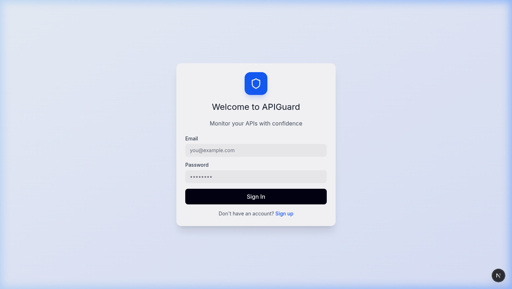
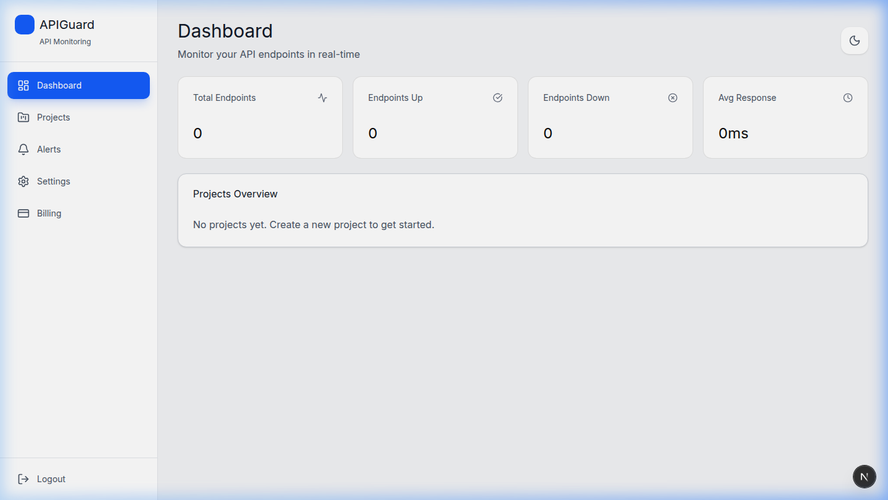
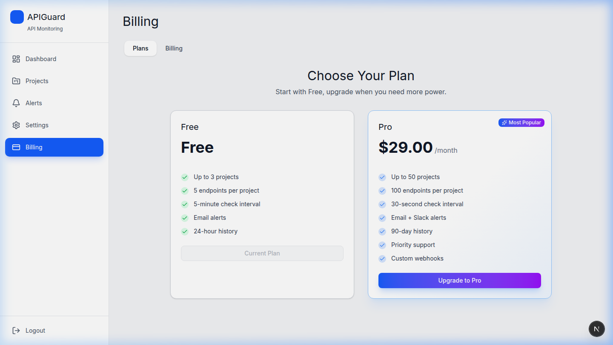

# APIGuard

API 엔드포인트 상태를 주기적으로 점검하고, 장애 시 알림을 보내는 모니터링 대시보드.  
워크스페이스 기반 멀티테넌시와 RBAC, 결제 시스템까지 갖춘 SaaS 구조로 설계했습니다.

> **Backend repo**: [apiguard-backend](../apiguard-backend)

---

## Screenshots

<table>
  <tr>
    <td></td>
    <td></td>
  </tr>
  <tr>
    <td align="center">Login</td>
    <td align="center">Dashboard</td>
  </tr>
  <tr>
    <td></td>
    <td></td>
  </tr>
  <tr>
    <td align="center">Settings</td>
    <td align="center">Billing & Plans</td>
  </tr>
</table>

---

## Tech Stack

- **Next.js 16** (App Router + React Compiler + Turbopack)
- **React 19** / TypeScript 5
- **TailwindCSS 4** + CSS Variables로 디자인 토큰 관리
- **Radix UI** / shadcn/ui — 접근성 확보된 UI 컴포넌트
- **Recharts** — 응답 시간·업타임 시각화
- **Framer Motion** — 페이지 전환, 마이크로 인터랙션
- **Axios** — 인터셉터 기반 JWT 자동 갱신
- **next-intl** — 한/영 다국어
- **next-themes** — 다크모드
- **pnpm** workspace

---

## Features

### 인증

JWT Access/Refresh Token 기반. Axios 인터셉터에서 401 응답 시 자동으로 토큰을 갱신하고 원래 요청을 재시도합니다.

### 워크스페이스 & RBAC

워크스페이스 단위로 데이터가 격리되고, 역할 계층(`Owner > Admin > Member > Viewer`)에 따라 UI 노출과 API 접근을 모두 제어합니다. `RequireRole` 컴포넌트 가드와 `permissions.ts` 유틸리티로 프론트엔드 권한 체크를 처리합니다.

### 모니터링

프로젝트 안에 엔드포인트를 등록하면 백엔드가 주기적으로 헬스체크를 수행합니다. HTTP 메서드·헤더·바디·기대 상태 코드를 커스터마이징할 수 있고, 점검 결과는 Recharts로 시각화됩니다.

### 알림

연속 실패 횟수 기반 알림 규칙을 설정할 수 있고, 이메일·Slack·Webhook 채널을 지원합니다.

### 결제

토스페이먼츠 연동. Free/Pro 두 가지 플랜을 제공하며, 플랜에 따라 엔드포인트 수·점검 주기·멤버 수 등이 제한됩니다.

|                     | Free |  Pro   |
| ------------------- | :--: | :----: |
| 엔드포인트/프로젝트 |  5   |   50   |
| 최소 점검 주기      | 5분  |  1분   |
| 멤버                |  1   | 무제한 |
| 데이터 보관         | 7일  |  90일  |

### i18n & 테마

`next-intl`로 한국어/영어 전환, `next-themes`로 시스템 테마 연동 다크모드를 지원합니다.

---

## Project Structure

```
src/
├── app/
│   ├── globals.css                # 디자인 토큰, CSS 변수
│   ├── layout.tsx                 # 루트 레이아웃
│   └── [locale]/
│       ├── (auth)/                # 로그인, 회원가입
│       └── (dashboard)/           # 인증 필요 영역
│           ├── dashboard/
│           ├── projects/          # 프로젝트 & 엔드포인트 CRUD
│           ├── alerts/
│           ├── billing/
│           ├── payment/           # 토스페이먼츠 콜백
│           ├── admin/             # 멤버 관리
│           └── settings/
├── components/
│   ├── ui/                        # shadcn/ui 컴포넌트 46개
│   ├── RequireRole.tsx            # RBAC 가드
│   └── ...
├── contexts/
│   └── auth-context.tsx           # JWT 인증 상태
├── lib/
│   ├── api/                       # 도메인별 API 클라이언트
│   ├── api-client.ts              # Axios 인스턴스, 인터셉터
│   ├── permissions.ts             # 역할 권한 유틸
│   └── plans.ts                   # 플랜 정의 & 제한 로직
└── messages/
    ├── ko.json
    └── en.json
```

---

## Architecture

```
Browser
  └─ Next.js 16 App Router
       ├─ Auth Context (JWT 관리)
       ├─ Pages & Components
       ├─ i18n (next-intl, ko/en)
       └─ Axios Client (인터셉터, 자동 토큰 갱신)
              │
              ▼  Next.js Rewrite (/api/* → Backend)
       Spring Boot Backend
       ├─ Auth     ├─ Workspace & RBAC
       ├─ Health Check (스케줄러)
       └─ Payment (토스페이먼츠)
```

---

## Related Docs

- [API Spec](./API_SPEC.md)
